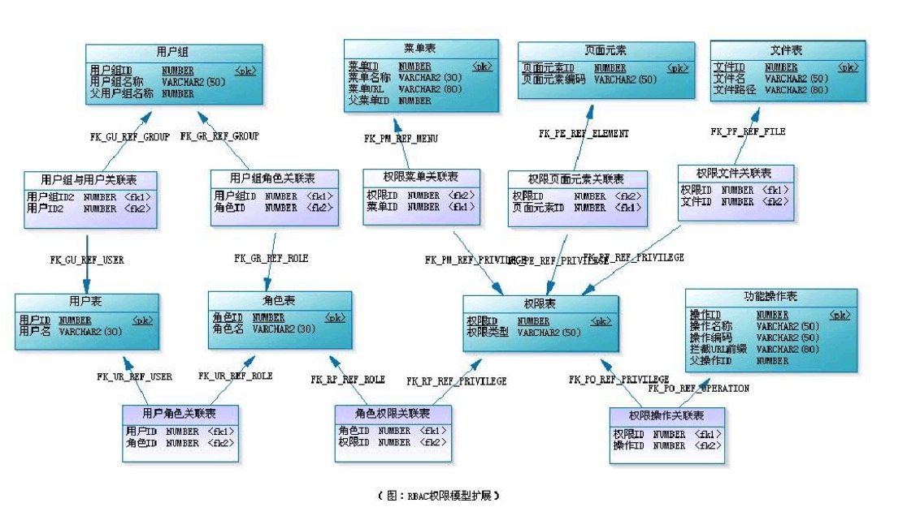
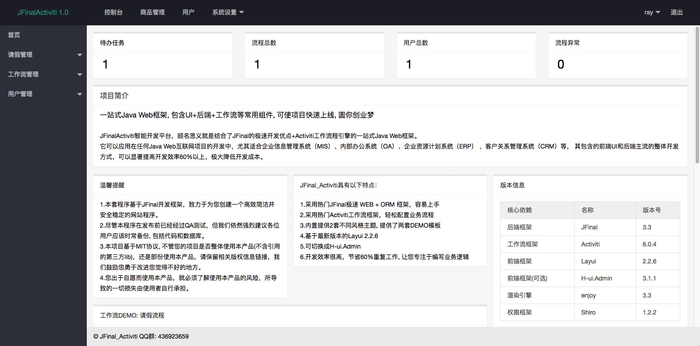
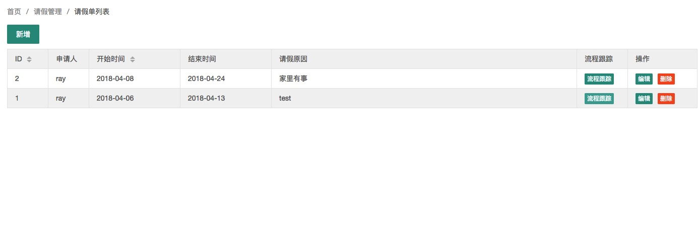
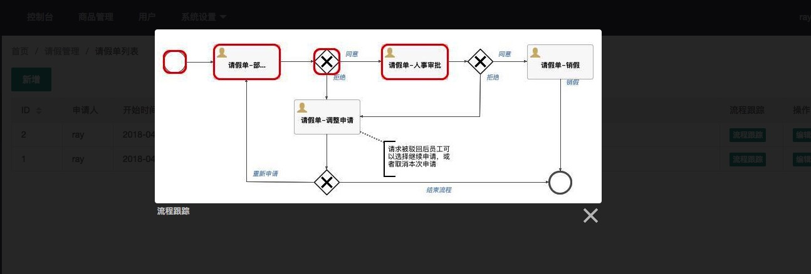

------------------------------------------------

> JFinalActiviti 1.0

------------------------------------------------
## JFinalActiviti 框架简介
一站式Java Web框架, 包含UI+后端+工作流等常用组件, 可使项目快速上线, 圆你创业梦   

JFinalActiviti智能开发框架，顾名思义就是结合了JFinal的极速开发优点+Activiti工作流程引擎的一站式Java Web框架。

它可以应用在任何Java Web互联网项目的开发中，尤其适合企业信息管理系统（MIS）、内部办公系统（OA）、企业资源计划系统（ERP） 、客户关系管理系统（CRM）等， 其包含的前端UI和后端主流的整体开发方式，可以显著提高开发效率60%以上，极大降低开发成本。

JFinal以易学易用著称，让您轻松打造自己的Web软件系统，同时也方便二次开发，让您快速搭建Web软件系统，为您节约更多时间，去陪恋人、家人和朋友。

## JFinalActiviti 技术特点

1.  采用热门JFinal极速 WEB + ORM 框架，容易上手。
2.  采用热门Activiti工作流框架，利用BPMN流程编辑器轻松配置业务流程。
3.  整合了Activiti使用JFinal的DataSource, 极大提高工作流引擎的数据库查询操作效率。
4.  采用Shiro进行登录验证。  
5.  内置提供Layui2.2.6UI, 提供了工作流DEMO所需的几个模板页面。
6.  基于[RBAC](https://wenku.baidu.com/view/dbd65c22ccbff121dd368372.html?sxts=1523547424269)的权限管理实现, 不必烦心如何设计权限分配模块, 拿来即用。


## JFinalActiviti 技术选型

1、后端

* JDK：1.7+
* 核心框架：JFinal 3.3, JFinal-ext2 2.0.5
* 安全框架：Apache Shiro 1.3.2
* 数据库连接池：Alibaba Druid 1.0.27
* 缓存框架：Ehcache 2.10.2
* 日志管理：SLF4J 1.7.7、Log4j 1.2.17
* 工具类：Apache Commons-lang3 3.1、fastjson 1.2.19

2、前端

* UI框架：layui-2.2.6
* 表格插件：layui table 或 datatables
* 数据图表：echarts

> 运行项目配置说明

```
1、具备运行环境：JDK 1.7+、Maven 3.0+、MySQL 5.6+、Eclipse Luna

2、git下载项目后，在Eclipse 左侧空白处右击->import-import-> Existing Maven Projects

3、根据 \src\main\resources\JFinalActiviti.properties 配置数据库

4、导入数据库 \db_scrip\db_init.sql

5、打开 com.jfa.config.JfinalActivitiConfig 文件，右键单击该文件并选择 Debug As ---> Java Application。

```

## 演示地址

1. 后台 localhost:8080 请点[查看](http://localhost:8080)；

2. 用户名/密码：ray/123456

3. (暂无)API文档地址：请点[查看](http://localhost:8080/swagger.jhtml)；

## 技术交流
QQ群: 436923659

## 系统演示






